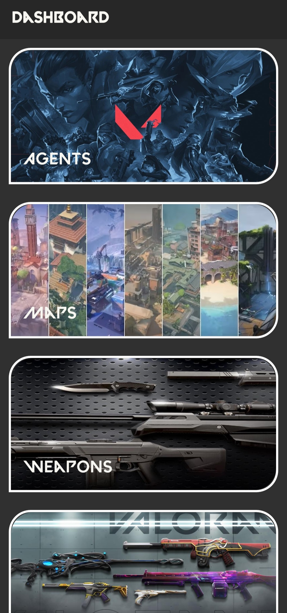
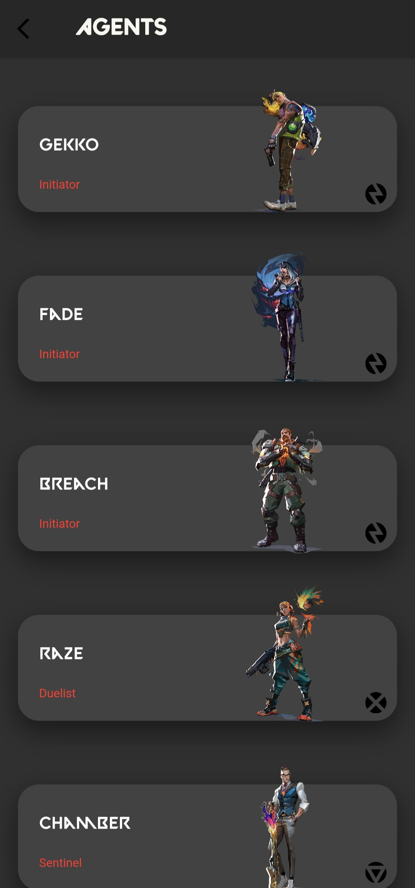
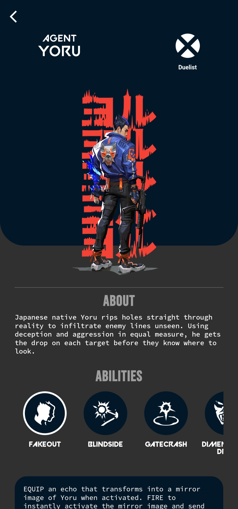
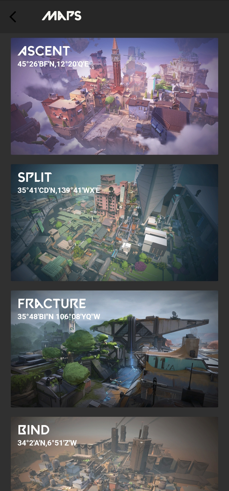
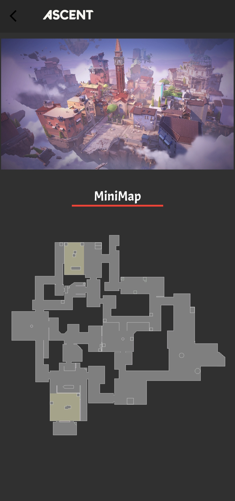
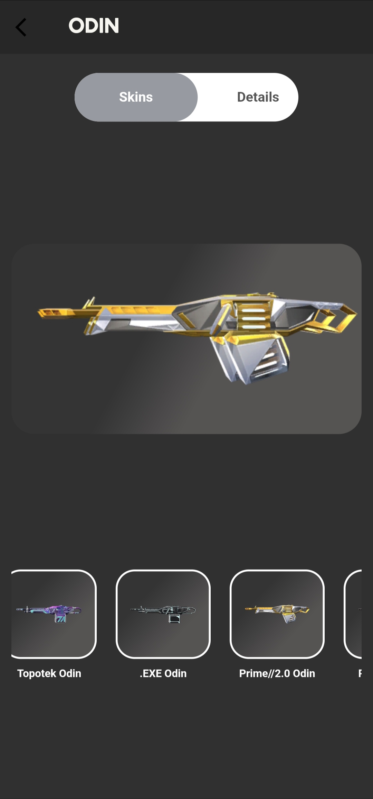
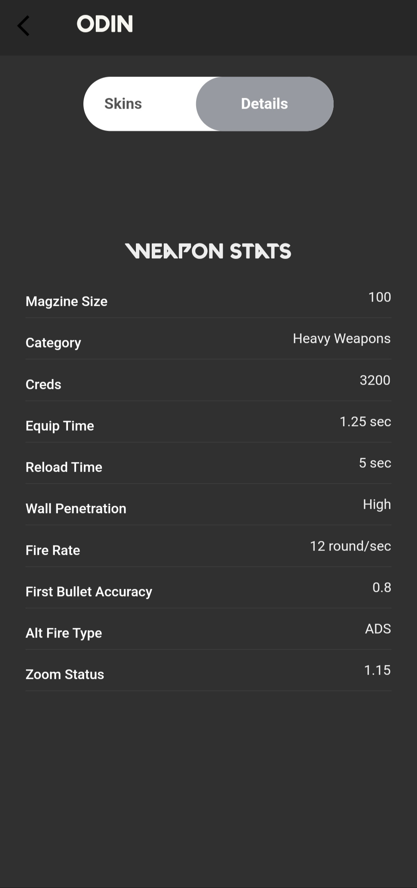
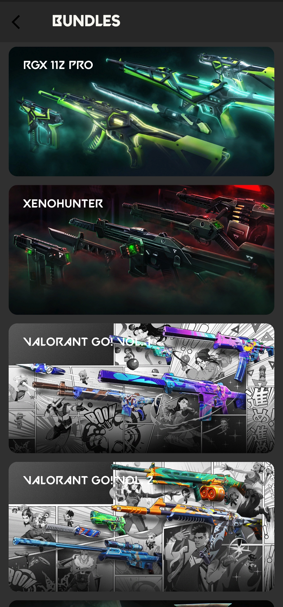

# Valorant Info

A new Flutter project.

This project is a mobile application build with flutter having information about a fps game,
it's agents, maps, weapons, skins, bundle, etc...

Code is not at all optimised, no state management, no route management, no even folder management.
I am still working on the app.

# Here are some example screenshots from the app:

 

# Some Video Examples from the app:

Agents Screen

https://user-images.githubusercontent.com/82653687/226265648-c0c4a279-6a86-4107-9117-f2833febfc46.mp4

Weapons Screen

https://user-images.githubusercontent.com/82653687/226265776-7810834c-2121-4bcf-b662-bc37cd44afa0.mp4

